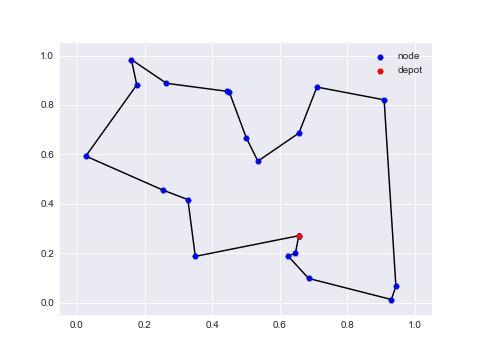

# TSP-improve
This repo implements paper [Wu et. al., *Learning Improvement Heuristics for Solving Routing Problems*, IEEE Transactions on Neural Networks and Learning Systems, 2021](https://arxiv.org/abs/1912.05784v2), which solves TSP with the improvement-base Deep Reinforcement Learning method.



# Paper
For more details, please see the paper [Wu et. al., *Learning Improvement Heuristics for Solving Routing Problems*, IEEE Transactions on Neural Networks and Learning Systems, 2021](https://arxiv.org/abs/1912.05784v2).

```
@article{wu2021learning,
  title={Learning improvement heuristics for solving routing problem},
  author={Wu, Yaoxin and Song, Wen and Cao, Zhiguang and Zhang, Jie and Lim, Andrew},
  journal={IEEE Transactions on Neural Networks and Learning Systems},
  year={2021}
}
```

# Enhanced Reward Mechanism Using Optimal Tours
This implementation extends the original approach by incorporating a mechanism to leverage pre-computed optimal tours during training. The new features include:

1. **Edge Overlap Reward:** The agent receives an additional reward when it increases the number of edges in its solution that match the edges in the known optimal tour. This provides a denser learning signal and guides the agent toward better solution structures.

2. **Edge Breaking Penalty:** Optionally, the agent can be penalized for breaking edges that are part of the optimal solution, encouraging it to preserve good solution components.

To use these features, you need to:
1. Pre-compute optimal tours for your training instances using a solver like OR-Tools or Concorde
2. Store the tours in a pickle file in the same format as the training data
3. Enable the features with the following command-line arguments:

```
--use_optimal_tours --optimal_tours_path PATH_TO_OPTIMAL_TOURS --overlap_reward_weight 0.2 --break_penalty_weight 0.0
```

The weights control the balance between the original cost-based reward and the new structure-based components:
- `overlap_reward_weight` (β): Weight for rewarding improvement in edge overlap (recommended: 0.1-0.3)
- `break_penalty_weight` (γ): Weight for penalizing the breaking of optimal edges (recommended: start with 0, increase if needed)

# One more thing
You may also be interested in our new approaches:

- [DACT](https://github.com/yining043/VRP-DACT) (NeurIPS 2021) which is more advanced than the model implemented in this repo. DACT achieves the SOTA performance among purely learning-based improvement solvers for routing problems. Paper: Yining Ma, Jingwen Li, Zhiguang Cao, Wen Song, Le Zhang, Zhenghua Chen, Jing Tang, “[Learning to iteratively solve routing problems with dual-aspect collaborative transformer](https://arxiv.org/abs/2110.02544),” in Advances in Neural Information Processing Systems, vol. 34, 2021.
- [N2S](https://github.com/yining043/PDP-N2S) (IJCAI 2022) which makes DACT more efficient for solving pickup and delivery problems (PDPs). And the proposed Synthesis Attention (Synth-Att) could largely enhance the efficiency of DACT. Paper: Yining Ma, Jingwen Li, Zhiguang Cao, Wen Song, Hongliang Guo, Yuejiao Gong and Yeow Meng Chee, “[Efficient Neural Neighborhood Search for Pickup and Delivery Problems](https://arxiv.org/abs/2204.11399),” in the 31st International Joint Conference on Artificial Intelligence (IJCAI 22), 2022.

# Jupyter Notebook
We provide a Jupyter notebook to help you get started and understand our code. Please open the  [notebook here](Solving%20TSP%20with%20Improvement-base%20DRL.ipynb) for more details.

Note: due to the 100MB limit of Github, please download the logs folder for the pre-trained model via [Google Drive](https://drive.google.com/drive/folders/1IaFPXh1IzHz02LqBSRa2wqhPjQ7WksOd?usp=sharing) and put it under './logs/pre_trained/' folder.

# Dependencies
## Install with pip
* Python>=3.6
* PyTorch>=1.1
* numpy
* tqdm
* cv2
* tensorboard_logger
* imageio (optional, for plots)

## Troubleshooting
For the exception below from package tensorboard_logger,
```python
AttributeError: module 'scipy.misc' has no attribute 'toimage'
```
Please refer to [issue #27](https://github.com/TeamHG-Memex/tensorboard_logger/issues/27) to fix it.

# Solving TSP
## Training
```python
CUDA_VISIBLE_DEVICES=0 python run.py --graph_size 20 --seed 1234 --n_epochs 100 --batch_size 512 --epoch_size 5120 --val_size 1000 --eval_batch_size 1000 --val_dataset './datasets/tsp_20_10000.pkl' --no_assert --run_name training
```

## Test only
```python
--eval_only --load_path '{add model to load here}'
```
Note: A pre-trained model can be found at './outputs/tsp_20/tsp_20200714T212735/epoch-99.pt'

# Acknowledgements
The code is  based on the repo [wouterkool/attention-learn-to-route](https://github.com/wouterkool/attention-learn-to-route) and the paper [Wu et. al., *Learning Improvement Heuristics for Solving Routing Problems*, IEEE Transactions on Neural Networks and Learning Systems, 2021](https://arxiv.org/abs/1912.05784v2).
